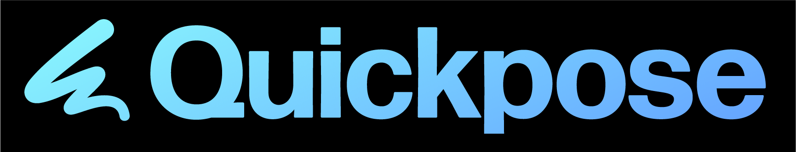
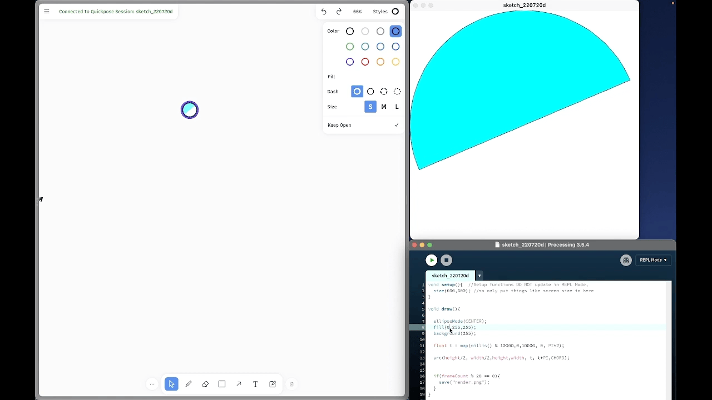
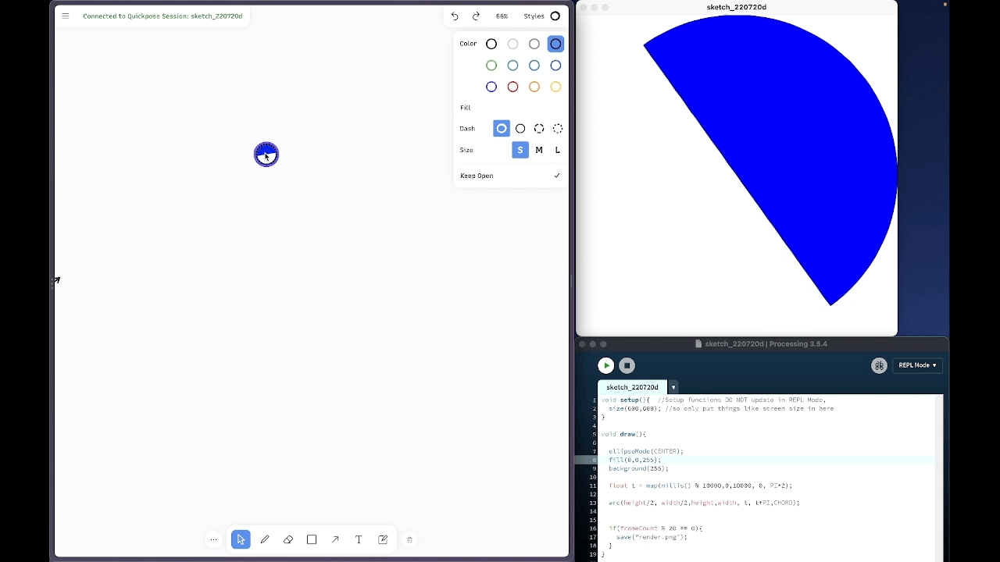
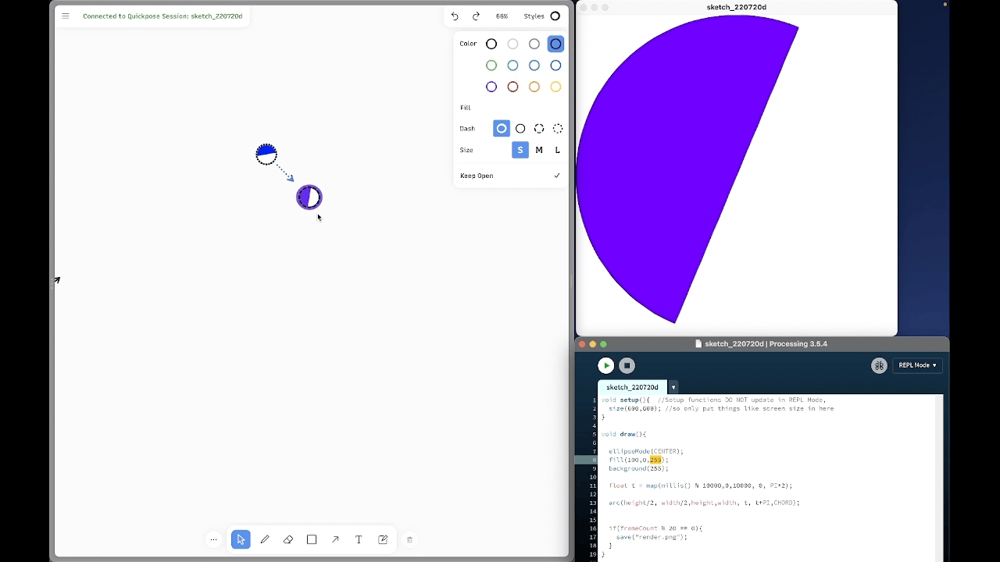
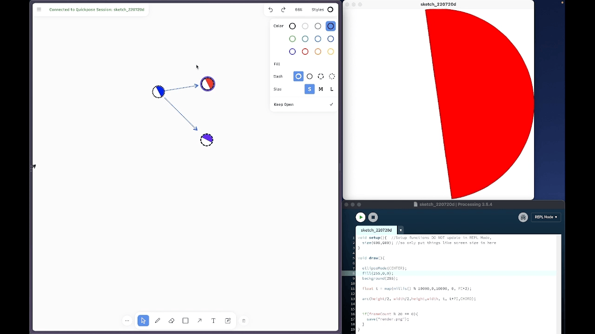
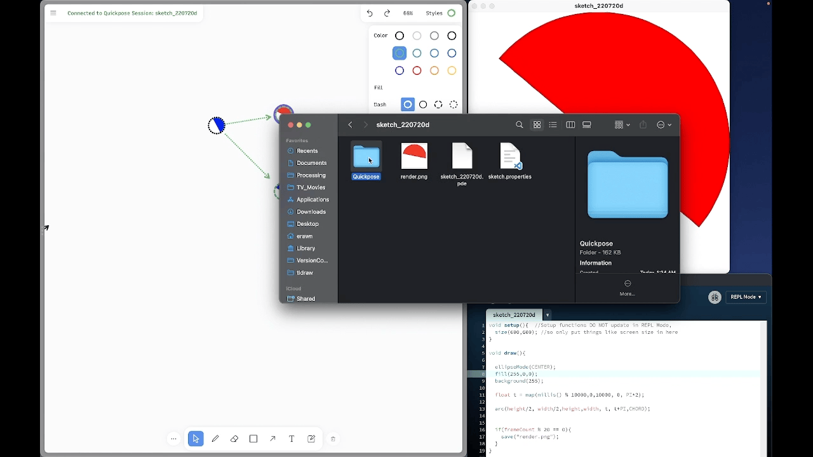

# Quickpose : Version Control for Sketching in Code

  

### Quickpose is a version control system for [Processing](https://processing.org) designed for creative exploration. With 1-click forking and navigating, canvas annotations and notes, and automatic saves and backups, Quickpose isn't just version control system,  *it helps you manage your entire creative process*. 

This is an ongoing research project by [Eric Rawn](https://www.ericrawn.media/) as a version control system for Processing. It's currently unreleased, but expect it soon! 

**[Interested in participating in a (paid) study of this tool?](https://github.com/erawn/Quickpose/wiki)**

***
# What is Quickpose?

## Quickpose is a version control system inside of a canvas editor — it directly links your canvas to your code state:

  

## You can fork a version with just a single (shift) click:

  

## To change versions, just click the version on your canvas and the editor will update:

  

## The canvas editor works as you'd expect, with shapes, scribbles, arrows, stickies, and Images:

  

## Putting version control in a canvas allows us to do things like _export by color_:
Export By Color Menu       |  Your Export in Your Sketch Folder
:-------------------------:|:-------------------------:
  |  

REPL mode is highly recommended for a smooth experience. 

**If you're interested in this project and want to learn more, shoot me an email at erawn@berkeley.edu**. Otherwise, stay tuned for an official release (hopefully this fall!) 

If you've been invited to evaluate it and are looking for info, please take a look at the [documentation in the wiki](https://github.com/erawn/Quickpose/wiki/What-happens-when-you-run-Quickpose-on-a-Processing-Project).

Quickpose is currently in two parts: a canvas-editor front-end which is a fork of Tldraw, by steve ruiz, and a backend written as a Tool for Processing 3.5.4

This project relies on the amazing work in Tldraw - please consider becoming a sponsor of Steve's(https://github.com/sponsors/steveruizok?frequency=recurring&sponsor=steveruizok).
