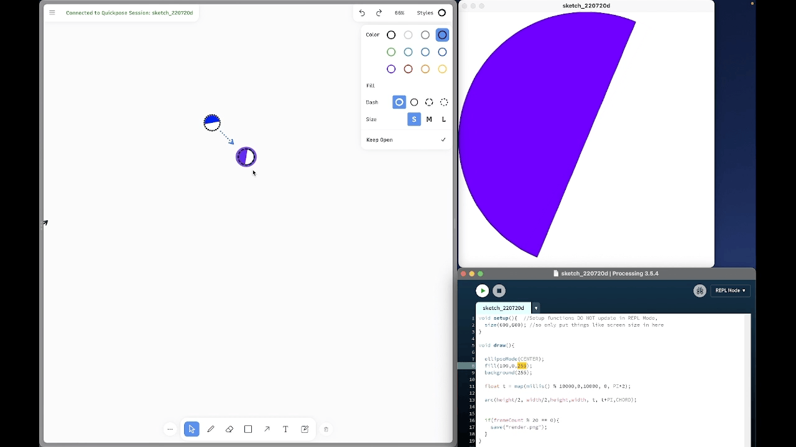
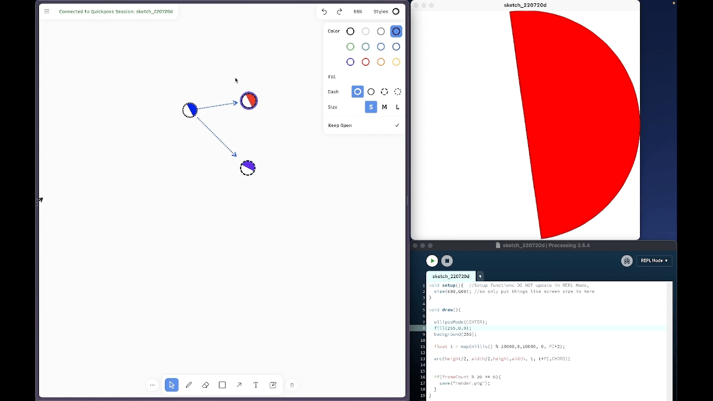
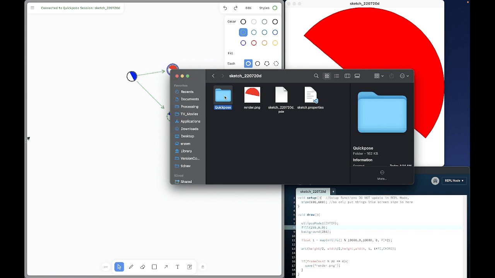

# Getting Started 

## Quickpose is a version control system inside of a canvas editor — it directly links your canvas to your code state:

  

## You can fork a version with just a single (shift) click:

  

## To change versions, just click the version on your canvas and the editor will update:

  

## The canvas editor works as you'd expect, with shapes, scribbles, arrows, stickies, and Images:

  

## Putting version control in a canvas allows us to do things like _export by color_:
Export By Color Menu       |  Your Export in Your Sketch Folder
:-------------------------:|:-------------------------:
  |  

REPL mode is highly recommended for a smooth experience. 
